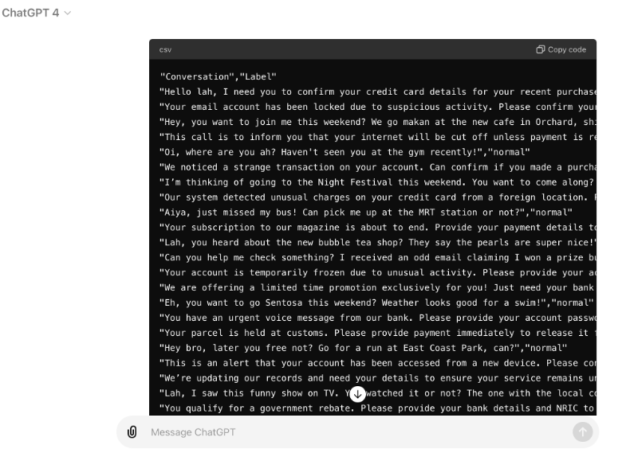

# ScamDetector
The project compares performance of different machine learning models to perform binary classification of phone call content to identify whether it is a "scam" or "normal" conversation. 

## Dataset
The dataset consist of one feature which is the conversation and the output with label either "fraud" or "normal". To help detect phone scam targeted at Singapore, conversations were generated with Generative AI tools that will add everday conversations in Singapore. All the data is combined on a single *ScamDataset.csv* file.

Source:
- https://www.kaggle.com/datasets/narayanyadav/fraud-call-india-dataset
- https://www.kaggle.com/datasets/uciml/sms-spam-collection-dataset
- https://github.com/wspr-ncsu/robocall-audio-dataset/blob/main/metadata.csv
- https://huggingface.co/datasets/alissonpadua/ham-spam-scam-toxic

Generated data:


## Setup
### Prerequirsite
Python Jupyter Notebook was used to develop the code to evaluate the different model. This model can be run on a cloud environment service like Google CoLab or run on a local environment with a Nivdea CUDA supported GPU.

1. Install the python liberies

``` 
    pip install -r requirements.txt
```

(For running on local environment, make sure cuda toolkit is installed if your machine has a Nvidea GPU.)

2. For training and evaluating models (Naive bayes, SVM, Random Forest, Logistic Regression, LSTM)

Run conventional-models.ipynb

3. For training and evaluating models (Bert, RoBERTa and DistilBERT)

Run transformer_models.ipynb

4. For training and evaluating models (GPT2 and Llama 3)

- Run gpt2Model.ipynb
- Run llama3_Fine_Tuning.ipynb


